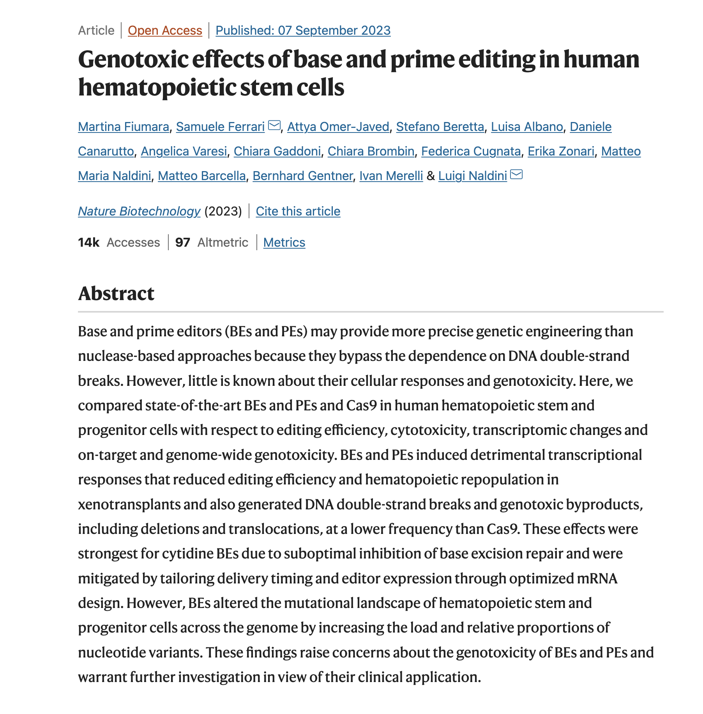

# Genotoxic Effects of Base Editors

A presentation for engineers with minimal background in biology to understand
the structure, mechanisms and clinical development of base editing technology.

A selection of methods and data from Fiumara et. al (_Genotoxic effects of base
and prime editing in human hematopoietic stem cells_ [^1]) is covered in depth,
along with a motivation for the experimental design.

## Overview

- Introduction to gene editing tools
- Cas9 structure and mechanisms
- Base Editors structure and mechanisms
- State of BEs in the clinic
- Defining "Genotoxicity"
- Designing an experiment to evaluate BE behavior

[^1]: Fiumara, M., Ferrari, S., Omer-Javed, A. et al. Genotoxic effects of base and prime editing in human hematopoietic stem cells. Nat Biotechnol (2023). https://doi.org/10.1038/s41587-023-01915-4
