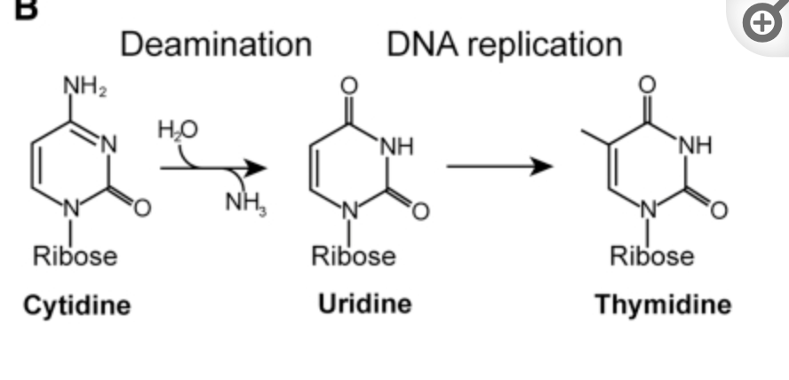
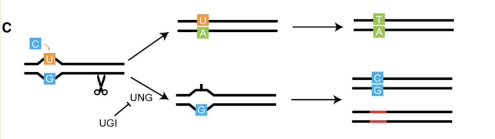
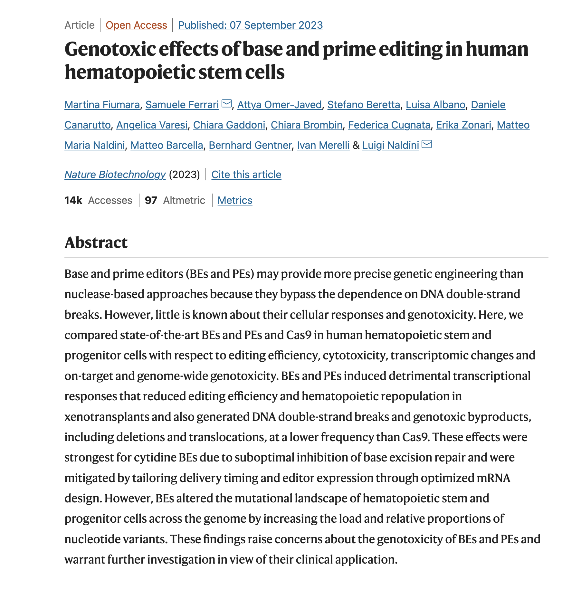
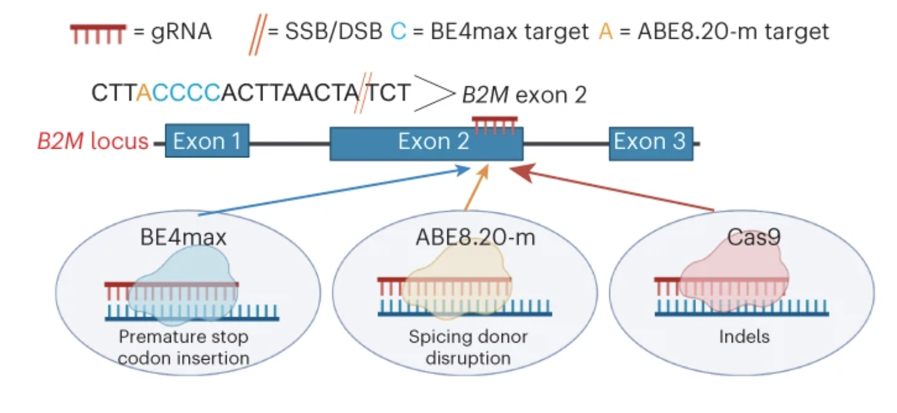
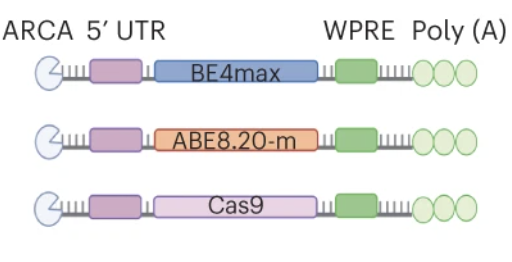
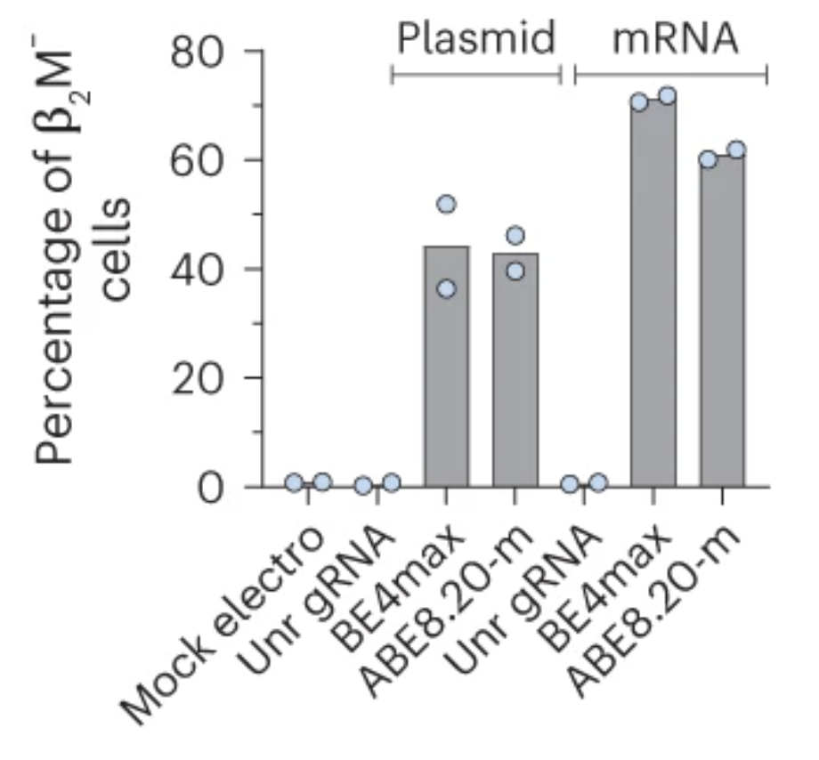
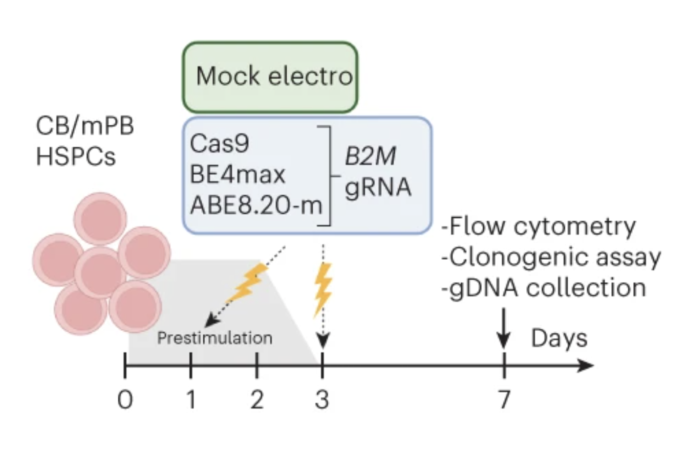
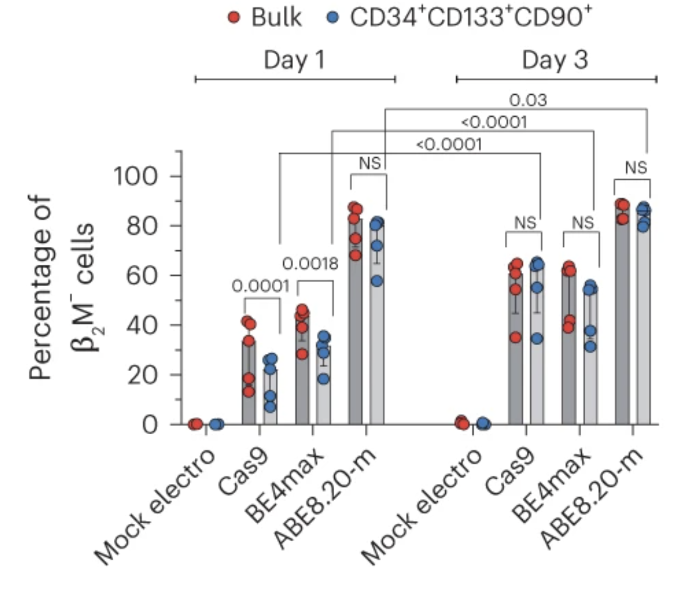

# Genotoxic effects of base editors
## Analyzing methods from Fiumara et. al 
### (from the perspective of an engineer)

---

# Overview

- Introduction to gene editing tools
- Cas9 structure and mechanisms
- Base Editors structure and mechanisms
- State of BEs in the clinic
- Defining "Genotoxicity"
- Designing an experiment to evaluate BE behavior

---

# Gene editing machinery

Broadly, editors are molecular tools that allow us to change the DNA within
cells.

They are **nucleases**, enzymes that cut DNA, that have been discovered and
isolated from bacterial immune systems. 

Editors have been engineered in a variety of ways to gain new capabilities:

* types of edits (swap letters, insertions, deletions)
* how efficient they can make edits
* how accurate they can make edits (or how little they mess up)
* how isolated their behavior is from other mechanisms in the cell

---

# Cas9

Cas9 is a nuclease isolated from bacteria (Streptococcus pyogenes). 

- Paired with 20 character RNA sequence 
- Allows it to bind to specific locations on the genome 
- Makes **double-stranded** cuts of the DNA.

---

# CRIPSR? Cas?

* CRISPR is a *location* and *encoding scheme* for guide RNAs
in the bacteria's genome.

* [Clustered Regularly Interspaced Short Palindromic Repeats]

* Useful guides are retrieved to protect the host against
pathogens (destroy DNA)

* Cas9 is just one of many Cas nucleases

*  We continue to discover new natural Cas proteins with unique cutting
behavior and structure.

---

---

# Cas9 Editing Mechanisms

Cas9 can be used in one of two ways to alter the guide site:

* *Disrupt* cut site with uncontrolled insertions or deletions
* *Introduce new characters* to cut site

---

# NHEJ - Disrupting cut site with Cas

Non-homology End Joining [NHEJ]

* Rely on existing repair mechanisms to join the disconnected ends

* Stochastically introduces insertions or deletions that disrupt function of gene

---

# HDR - Editing cut site with Cas

Homology Directed Repair [HDR]

A homologous sequence is a similar sequence.

Use template sequence to introduce new letters to our cut site.

---

# Problems with Cas as a tool

* Double-stranded breaks trigger repair pathways (p53) that can introduce large
insertions, deletions, "translocations"

* Occurs with both techniques, symptom of the DSB

* HDR can only occurs during fraction of cell cycle

---

# Base Editors

Double-stranded breaks are problematic

Base Editors (BE) allow conversion of single nucleotides  with single
stranded break.

There are two classes of BEs, defined by the nucleotide they swap

**CBE** (C -> T)
**ABE** (A -> G)

---

# Structure of BEs

They are a fusion of three proteins:

* catalytically (full or partial) **inactive Cas protein**
* **Deaminase** - chemically modifies nucleotide
* UGI - **Inhibitor of a repair pathway** (CBEs only)

---

# [BE Structure] Cas nickase

Also called **nCas**.

Produce "nicks" or single-stranded breaks.

---
# [BE Structure] Deeaminase

Remove **amine group** (NH3) turns "C" into "U".

"U" becomes "T" during DNA replication.

---

# [BE Structure] Inhibition of Uracil Repair with UGI

Inhibit natural repair of "U" back to "C".

---

# Advantage of BEs

* No DSBs means less large insertions and deletions from repair pathways
* **Precise** (single nucleotide resolution)
* **Accurate** (less "off targets")

* (Many rare diseases are caused by single nucleotide mutations)

---

# Status in the Clinic

* **Beam Therapeutics**: treatment for sickle cell disease (single mutation) [Phase 1]

* **Verve Therapeutics**: treatment for transthyretin amyloidosis (ATTR), a rare genetic disease [Phase 1]

* **Editas Medicine**: treatment for treat Leber congenital amaurosis (LCA) [Phase1/2]

---

# Genotoxicity

Base Editors might create unintended edits that have a toxic effect on
patients.

Potential failure modes:

* Single stranded break can become a double stranded break
* "Constitutive" expression of deaminases causing havoc across genome
* Engineered components triggering bad response from cell

---

---

# Analyzing "imprecise outcomes at target sites"

## Question

How do we design an experiment to measure the editing behavior of different
base editors?

## Overview

* Identify gene to disrupt
* Design guides to disrupt gene
* Electroporate cells with different editors (and control)
* Measure expressed protein at different time points
* Sequence the cell to observe potential misbehavior

---

# Selecting a gene that is easy to measure

## Beta2-microglublin

- Expressed on the cell surface
- Easy to link gene knock out to observation (no protein)
- Measure with a flow cytometry experiment

---

# Designing guides using unique properties of editors

---

# Delivering editors to cells

- mRNA sequences with encoded editors are designed
- Cells are **electroporated** to induce uptake and expression of foreign sequence

---

# Expression of surface protein as a proxy for edit efficiency

- **Y-axis**: Expression of our targeted surface protein
- **X-axis**: The editor introduced to cell

---

# Effect of timing on edit efficiency

---

# Effect of timing on edit efficiency (cont.)

How does a longer growing time of cell population lead to greater edit
efficiency?

- **Y-axis**: Expression of our targeted surface protein
- **X-axis**: The editor introduced to cell

---

# Exercises

## Understand how modifying gRNA improves BE efficiency

Review section "Optimized mRNA design improves efficiency and precision of base editing at target sites" 

## Refer to linked twitter thread and understand arguments

Explain why claims made in this paper about off target behavior, editing efficiency, recruited pathways, etc. might
be inflated

> https://twitter.com/zhaoweiasu/status/1700382031241437646

---
